# Hướng dẫn sử dụng — my-project-manager

Trợ lý ảo tự động làm công việc quản lý dự án (PM / Scrum Master): đọc Jira · GitHub · Confluence ·
Slack, phân tích, rồi *tự hành động* (viết báo cáo, cảnh báo rủi ro, theo dõi OKR) như một PM thật.

Tài liệu này có **2 phần**:

- **Phần A — Cài đặt (1 lần, kỹ thuật):** dành cho người dựng hệ thống. Làm một lần lúc đầu.
- **Phần B — Vận hành hằng ngày (CEO / người quản lý):** không cần kỹ thuật. Dùng qua web + Telegram.

> **Ý tưởng cốt lõi:** trợ lý *tự chủ về tốc độ, không bao giờ tự chủ về trách nhiệm*. Mọi hành động
> ghi ra ngoài (đăng Slack, tạo trang Confluence, gộp PR…) đều đi qua một cửa kiểm soát duy nhất —
> **Action Gateway**. Việc nguy hiểm (mất dữ liệu, lộ bí mật) bị **chặn cứng**; việc quan trọng (gửi
> ra ngoài công ty, đóng PR) **chờ bạn duyệt** trước khi chạy.

---

# Phần A — Cài đặt (1 lần, kỹ thuật)

Chỉ cần làm một lần trên máy chạy hệ thống (macOS). Sau đó CEO vận hành 100% qua web + Telegram.

## A.1. Chuẩn bị

Cần sẵn trên máy (installer sẽ báo nếu thiếu, kèm lệnh cài):

| Công cụ | Cài bằng |
|---|---|
| `uv` (Python 3.12) | `curl -LsSf https://astral.sh/uv/install.sh \| sh` |
| Node.js + npm | `brew install node` |
| `git` | `brew install git` |
| `gh` (GitHub CLI) | `brew install gh` rồi `gh auth login` |

Ngoài ra cần **tài khoản + token** cho các dịch vụ tích hợp (điền sau, trong trình duyệt — **không**
gõ vào terminal):

- **OpenRouter** (bộ não LLM): 1 API key. Có giới hạn ngân sách $50/tháng, tự dừng.
- **Atlassian** (Jira + Confluence): site, email, 1 API token dùng chung.
- **Slack**: browser-token (xoxc + xoxd) + tên team.
- **GitHub**: qua `gh auth login` (không để trong file cấu hình).

## A.2. Cài bằng 1 lệnh

```bash
git clone https://github.com/phuc-nt/my-project-manager.git
cd my-project-manager
./deploy/install.sh
```

Script sẽ tự động:

1. **Kiểm tra công cụ** — thiếu gì báo ngay kèm lệnh cài chính xác, rồi dừng (không tự cài lên máy bạn).
2. `uv sync` — cài thư viện Python.
3. **Build giao diện web** vào thư mục tạm rồi thay vào chỗ đang chạy (không làm gián đoạn nếu web đang mở).
4. **Cài 3 MCP server** (Jira / Confluence / Slack). Mặc định: cài từ npm (bản đúng version,
   không cần build) vào `./.mcp-servers/` trong repo — 3 package đã publish. Thêm cờ `--mcp-dev`
   để tải + build thủ công 3 repo vào `~/workspace/` thay vì npm (dùng khi phát triển server local).
   - Muốn để chỗ khác (khi dùng `--mcp-dev`): đặt `MCP_BASE=<thư-mục>` trước khi chạy — script tự
     ghi đường dẫn vào `.env`.
5. **Cài dịch vụ launchd** (chạy nền, tự khởi động theo lịch).
6. **Kiểm tra sức khỏe** cuối: báo ✓/✗ cho từng phần (MCP, gh, đăng nhập) trước khi mở trình duyệt.

> **Chạy lại an toàn:** gọi lại `./deploy/install.sh` bất cứ lúc nào (sau `git pull` chẳng hạn). Nếu
> không có gì đổi, nó **không** khởi động lại dịch vụ — không làm chết agent đang chạy, không rớt phiên
> đăng nhập web. Chỉ khởi động lại phần thực sự thay đổi.

`gh auth login` là bước tương tác (không tự động được) — nếu chưa làm, health-gate sẽ nhắc.

## A.3. Điền bí mật trong trình duyệt (Setup Wizard)

Lần đầu, trình duyệt tự mở trang **Setup Wizard**. Đi qua các bước, mỗi bước có nút "Kiểm tra kết nối":

1. **OpenRouter (bộ não LLM)** — dán API key.
2. **Atlassian (Jira + Confluence)** — site, email, token, mã Jira project (vd `SCRUM`).
3. **Slack** — xoxc token, xoxd token, tên team, kênh đăng báo cáo.
4. **GitHub** — repo + kiểm tra `gh auth`.
5. **(Tùy chọn) Web search** — nếu dùng vai trò Nghiên cứu, bấm để bật Tavily hoặc Brave; điền API key. Không có = Nghiên cứu chỉ dùng nội bộ.
6. **Đặt mật khẩu** đăng nhập dashboard.

> **An toàn:** bí mật **chỉ** đi qua wizard này (ghi vào `.env` cục bộ), **không bao giờ** qua terminal
> hay URL. Sau khi hoàn tất, wizard tự khóa lại (không mở lại được để tránh chiếm quyền).

Xong bước này là hệ thống chạy. Từ đây trở đi xem **Phần B**.

## A.4. (Tùy chọn) Bật Telegram cho từng nhân sự ảo

Để CEO ra lệnh + nhận báo cáo qua Telegram: mỗi agent có thể gắn 1 bot Telegram riêng (tạo bot với
@BotFather, lấy token, gắn trong trang agent → tab "Kênh Telegram"). Xem chi tiết ở
[getting-started.md](v2/getting-started.md).

## A.5. Kiểm tra sức khỏe hệ thống

Bất cứ lúc nào, vào **Cài đặt → Sức khỏe hệ thống** trong web: bảng ✓/✗ từng kết nối. Mục nào lỗi sẽ
hiện lệnh khắc phục copy-paste được. Đây là chỗ để trả lời "vì sao agent không chạy?".

---

# Phần B — Vận hành hằng ngày (CEO / người quản lý)

Không cần kỹ thuật. Mọi thứ qua **web** (trình duyệt) và **Telegram** (nếu đã bật ở A.4).

Mở web ở địa chỉ máy chạy (mặc định `http://127.0.0.1:8765`), đăng nhập bằng mật khẩu đã đặt.

## B.1. Bốn khu vực chính

Thanh điều hướng có 4 mục (giao diện gọn, CEO-first):

| Mục | Để làm gì |
|---|---|
| **Văn phòng** | MÀN CHÍNH (mở app vào thẳng đây): giao việc, theo dõi đội làm realtime, xem kết quả bàn giao — theo từng phòng việc. |
| **Đội** | Nhân sự ảo: trạng thái, ngân sách, tạm dừng/bật/xoá/tạo mới. |
| **Duyệt** | Hàng đợi việc cần bạn **phê duyệt** (badge số) + bảng việc lẻ đã giao cho từng nhân sự. |
| **Trợ lý** | Chat quản trị: hỏi tình hình, tạo nhân sự bằng hội thoại, lệnh vận hành lẻ. |
| **Cài đặt** | Sức khỏe hệ thống, giao diện, chế độ nâng cao, tự-xác-nhận giao việc. |

## B.2. Tạo một nhân sự ảo mới

Vào **Đội** → bấm **"+ Tạo nhân sự ảo"**. Có 2 đường:

- **Qua hội thoại** (khuyến nghị): nút dẫn vào **Trợ lý**, trợ lý hỏi bạn từng bước (loại nhân sự,
  tên, dự án, báo cáo nào, lịch chạy) rồi tạo giúp.
- **Qua biểu mẫu**: nếu chưa có trợ lý điều hành, nút dẫn vào wizard tạo agent theo form.

Nhân sự ảo có thể thuộc nhiều "chuyên môn" (pack): PM, HR… mỗi loại làm các báo cáo khác nhau.

## B.2a. Tạo trưởng phòng (1-click)

Ở trang **Đội**, nút **"+ Tạo trưởng phòng"** tạo nhanh coordinator từ template `profiles/templates/truong-phong/` rồi
tự bộ lệnh làm trưởng phòng mặc định (`coordinator_id` trong `company.yaml`). Không cần biên tập gì,
bấm nút xong xong.

## B.3. Giao việc cho đội

Cách nhanh nhất (v15): vào **Văn phòng** → ô **giao việc** ngay dưới màn hình, gõ theo 3 kiểu:

- **`@tên-nhân-sự <việc>`** — chỉ định người **chịu trách nhiệm chính (PIC)**. Ví dụ:
  `@noi-dung viết bài giới thiệu sản phẩm mới`. Gõ `@` sẽ hiện danh sách nhân sự để chọn.
- **`@all <việc>`** hoặc **không @ ai** — đội tự chọn PIC: hệ thống đề xuất người có vai trò
  khớp nhất và hiện trong kế hoạch để bạn thấy trước.
- PIC luôn đảm nhận **bước chốt/tổng hợp cuối cùng** của việc; các bước chuyên môn khác vẫn
  chia cho đúng người (kết hợp thật). Trên màn 3D, bàn của PIC có dấu **⭐** + nhãn **PIC**.

Sau khi gõ: hệ thống phân rã thành tối đa 7 bước → hiện **kế hoạch + PIC** → bạn bấm
**"Xác nhận giao việc"** (hoặc **Huỷ**). Kế hoạch xác nhận xong bị khóa (hash), đội tự chạy.

**Phòng việc (v16):** mỗi việc giao xong mở một **phòng việc** riêng — danh sách phòng nằm
bên trái màn Văn phòng (● đang chạy / ⚠ kẹt / ✓ xong). Vào phòng để: **hỏi tiến độ**
("tiến độ thế nào?"), **chỉnh kế hoạch** ("chỉnh: bỏ bước cuối…" — có xem DIFF trước),
hoặc **giao việc con** cùng phòng ("giao @thiet-ke …"). Quay lại phòng cũ luôn thấy đủ
lịch sử hoạt động. Lưu ý: câu trả lời "hỏi tiến độ" chỉ hiện tại chỗ, không ghi vào nhật ký.

> **Quan trọng:** đội chỉ thật sự CHẠY việc khi **bộ điều phối** đang bật
> (`uv run python -m src.runtime.service`, hoặc dịch vụ nền theo mục A.2). Nếu nó chưa
> chạy, màn Văn phòng hiện **banner đỏ** cảnh báo — việc giao sẽ nằm chờ chứ không mất.

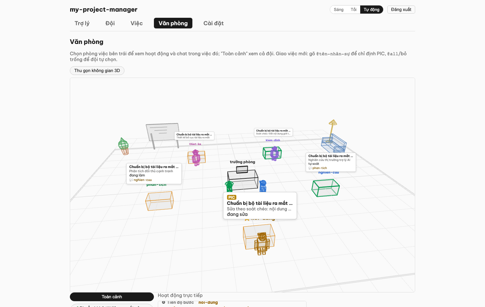

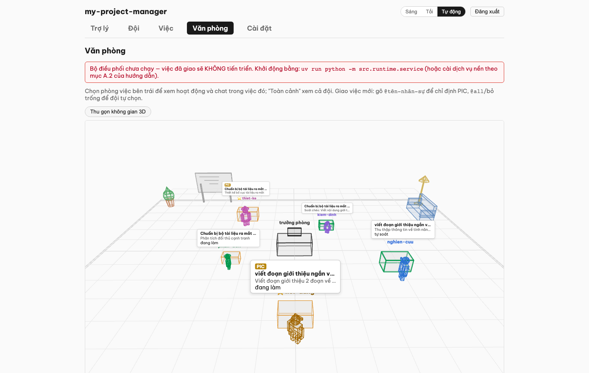

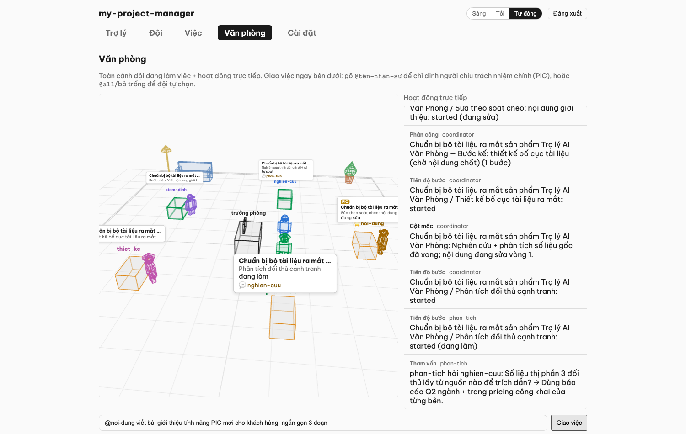

Muốn bỏ luôn bước bấm xác nhận? Bật **Cài đặt → "Tự xác nhận kế hoạch khi giao việc"** —
giao là chạy ngay (mọi việc gửi RA NGOÀI công ty vẫn chờ duyệt riêng như cũ):

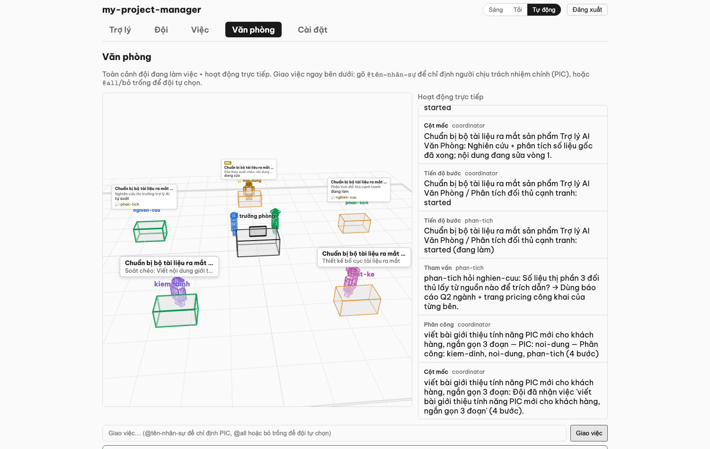

Vẫn giao được qua **Trợ lý** (gõ "giao việc …", hỏi-đáp từng bước) — cùng một đường xử lý.
Tiến trình hiển thị ngay cột phải màn Văn phòng; Telegram cũng nhận cột mốc (nhận việc /
xong bước / hoàn thành / cần duyệt).

### B.3a. Duyệt việc (quan trọng nhất)

Đây là chỗ bạn giữ quyền kiểm soát. Vào **Việc** — mỗi việc chờ duyệt hiện lý do ngắn gọn.

1. Bấm **"Xem & duyệt"** → hộp thoại hiện **tóm tắt tiếng Việt** việc trợ lý muốn làm, ví dụ:
   *"Tạo ticket Jira 'Sửa lỗi đăng nhập' trong dự án SCRUM"* hoặc *"Giao việc marketing tuần này cho đội"*.
2. Nếu việc **gửi thông tin RA NGOÀI công ty** (đăng kênh Slack ngoài, gửi email cho khách…), hộp
   thoại **tô đỏ đậm** và ghi rõ cảnh báo — đây là tín hiệu cuối để bạn cân nhắc.
3. Xem chi tiết kỹ thuật (nếu muốn) trong phần "chi tiết" gấp lại được.
4. Bấm **"Duyệt & thực hiện"** để chạy, hoặc **"Từ chối"** để bỏ.

> Những việc **nguy hiểm** (xoá vĩnh viễn dữ liệu, lộ bí mật) trợ lý **không bao giờ** làm được, kể cả
> khi bạn duyệt — chúng bị chặn cứng ở tầng dưới. Bạn chỉ duyệt những việc *có thể phục hồi*.

### B.3b. Đội tự kiểm và soát chéo (v13)

Mỗi bước công việc trải qua **vòng tự soát độc lập**:
- **Tự kiểm**: nhân sự chạy bước, tự so với yêu cầu (acceptance criteria), nếu không đạt thì tự sửa ≤2 lần.
- **Soát chéo**: sau bước xong, đồng nghiệp khác (kiểm định / QA) soát lại. Nếu cần sửa, bước quay lại tác giả tự sửa ≤2 lần.
- **Escalate**: nếu bước tự kiểm hoặc soát chéo không qua ≤2 lần → dừng + báo CEO xem xét.

Tiến trình này **tự động** (KHÔNG cần CEO duyệt từng lần tự kiểm/soát) — chỉ báo bạn khi kẹt.

### B.3c. Nhân sự hỏi ý kiến đồng nghiệp (v13)

Khi làm việc, nhân sự có thể hỏi ý kiến của đồng nghiệp khác (tối đa 2 câu/bước) để tham khảo SOUL + dự án của họ, rồi tiếp tục. Việc này:
- **Tự động, không cần CEO duyệt**: chỉ là tham vấn nội bộ (chỉ đọc, không ghi).
- **Hiển thị trên Văn phòng**: bong bóng hỏi-đáp giữa 2 bàn (1 hỏi, 1 trả lời).
- **Không tốn lượt rework**: là tham khảo, không phải "làm lại".

### B.3d. Chỉnh kế hoạch giữa chừng (v13)

Nếu kế hoạch đang chạy nhưng bạn muốn **sửa đổi** (bỏ bước không cần, thêm bước mới, hay giao lại người):

Vào **Trợ lý** → gõ **"chỉnh kế hoạch <id>: <yêu cầu>"** (ví dụ: "chỉnh kế hoạch task-123: bỏ bước phân tích, thêm bước soát hình ảnh").

Trợ lý sẽ:
1. Đề xuất sửa đổi (DIFF: giữ / bỏ / thêm bước + chi phí thay đổi).
2. Hiển thị **"DIFF"** để bạn xem thay đổi.
3. Nếu đồng ý, bấm **"Xác nhận sửa"** → kế hoạch cập nhật. Những bước đã xong giữ nguyên, những bước chờ/đang chạy sẽ chạy theo kế hoạch mới.

> **An toàn:** sửa đổi chỉ áp cho phần chờ chạy; phần đã xong không bị thay đổi. CEO (bạn) **luôn** xác nhận trước khi kế hoạch đổi.

## B.4. Chat với trợ lý điều hành

Vào **Trợ lý** (hoặc nhắn qua Telegram). Gõ câu hỏi/lệnh vào ô "Nhắn cho trợ lý…" rồi **Gửi**. Ví dụ:

- "Tình hình dự án SCRUM tuần này thế nào?"
- "Tạo cho tôi một nhân sự ảo theo dõi repo backend."
- "Chạy báo cáo hằng ngày ngay bây giờ."

> **An toàn:** trợ lý chỉ *xem trước* và hỏi lại; nó **không thực hiện** hành động ghi ra ngoài cho tới
> khi bạn gõ **"xác nhận"**. Nói chuyện thoải mái, không sợ nó tự ý làm.

## B.5. Xem báo cáo & số liệu + Văn phòng

- Báo cáo định kỳ (hằng ngày / tuần / OKR / nhân sự-chi phí) tự chạy theo lịch và đăng lên Slack /
  Confluence. Bạn cũng nhận tóm tắt qua Telegram.
- **Đội** cho thấy nhanh: ai đang chạy, tốn bao nhiêu ngân sách, có việc gì kẹt.
- **Văn phòng** (v17 — MÀN HÌNH CHÍNH, mở app vào thẳng đây): không gian 3D phía trên
  (thu gọn được) + **3 cột**: Phòng việc | Hoạt động trực tiếp | **Kết quả** + ô giao
  việc/chat dưới cùng — tất cả realtime.
  - **Cột Kết quả**: mọi bước đã bàn giao của phòng đang chọn — bấm vào là xem FULL nội
    dung **render markdown đẹp**, có nút **Copy** và **Tải .md**. Vào lại phòng cũ bất
    kỳ lúc nào để xem lại kết quả (lịch sử giữ nguyên trên đĩa).
  - Bóng thoại 3D chỉ hiện với nhân sự **đang làm việc** (hoặc đang tham vấn) — người đã
    xong/rảnh không treo thoại việc cũ nữa.

    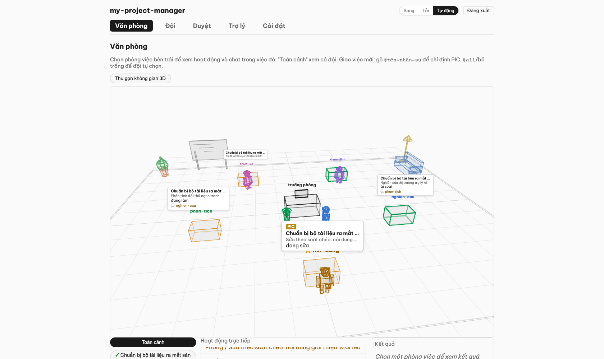

    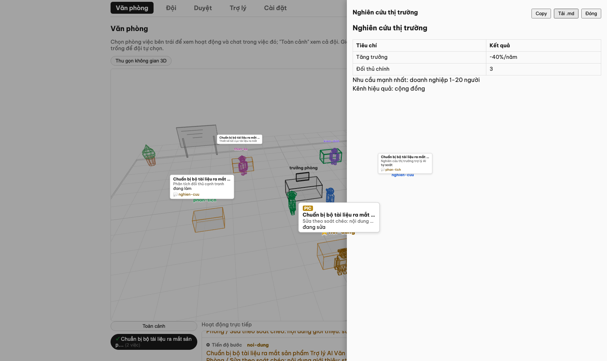


    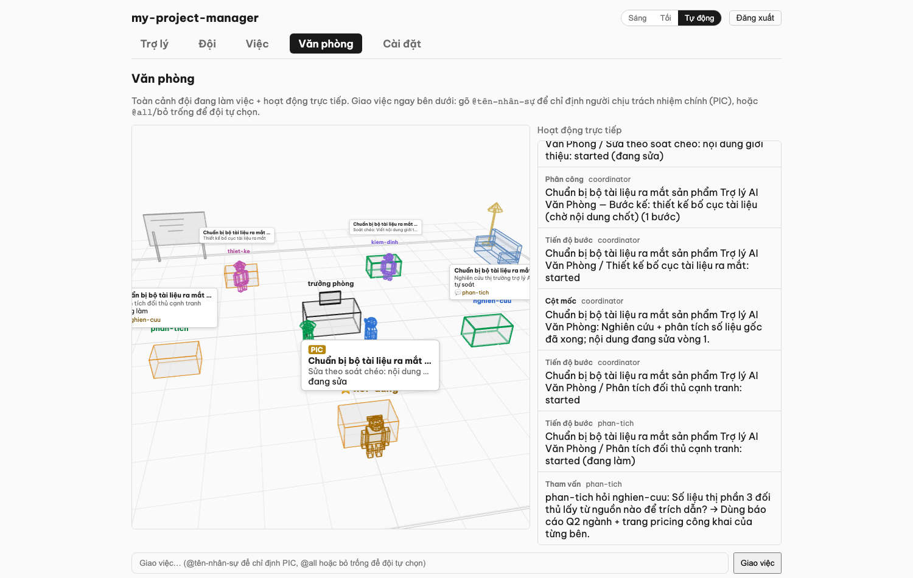

  - Không gian 3D: bàn trưởng phòng ở giữa, mỗi nhân sự một bàn với màu và phụ kiện riêng
    (nón / kính / cà vạt), có tay chân và nhịp thở nhẹ. Camera **tự xoay 360° chậm** (dừng
    khi bạn kéo chuột), nội thất văn phòng (chậu cây, bảng viết, ghế sofa, đèn cây); hai
    nhân sự hỏi ý kiến nhau thì **hai avatar rời bàn đi lại gần nhau** rồi tự về chỗ. Bàn
    của **PIC** có dấu ⭐ + nhãn PIC trên bong bóng (v15). Màu viền bàn = trạng thái: xám
    (chờ việc), xanh dương (nhận việc), cam (đang làm), xanh lá (xong). Mọi chuyển động
    đều từ sự kiện thật — không có hoạt cảnh giả.
  - **Nhật ký văn phòng** (menu nâng cao, `Văn phòng → Nhật ký`): dòng thời gian ĐẦY ĐỦ
    theo từng phòng việc — mỗi sự kiện 1 dòng (người, hành động, thời gian), có chọn
    phòng theo việc.

    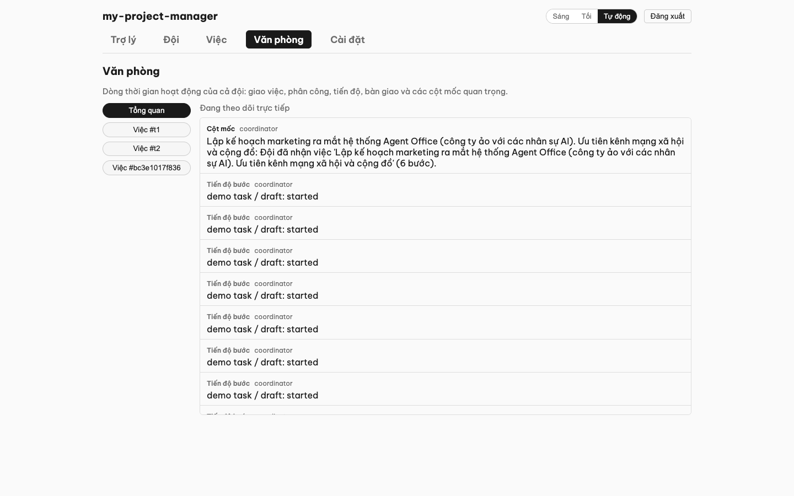

    Bong bóng còn hiện **giai đoạn của bước** theo thời gian thực: *đang làm* → *tự soát* →
    *đang sửa*, và V14 thêm *nhờ trợ giúp* (khi bước gặp lỗi, nhân sự tự hỏi đồng nghiệp và
    thử lại một lần trước khi báo thất bại).

    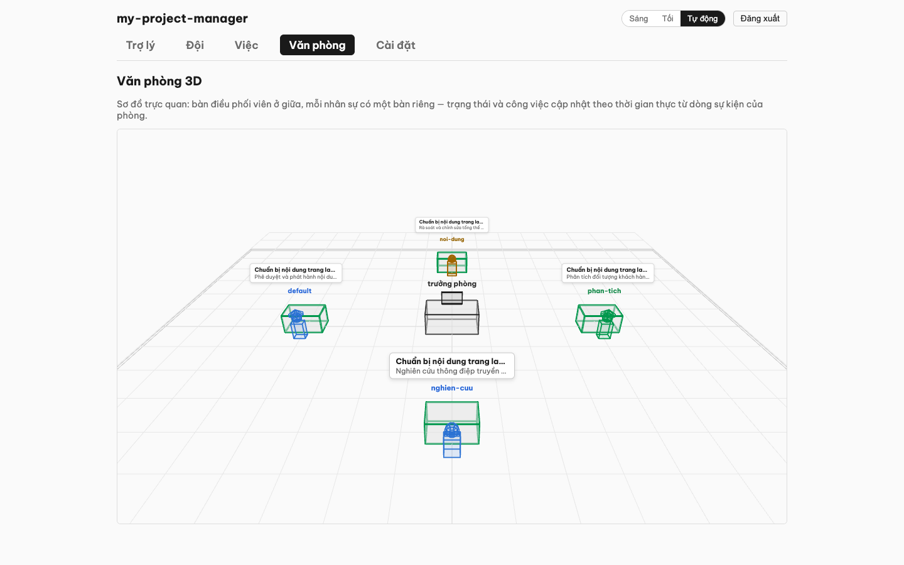

    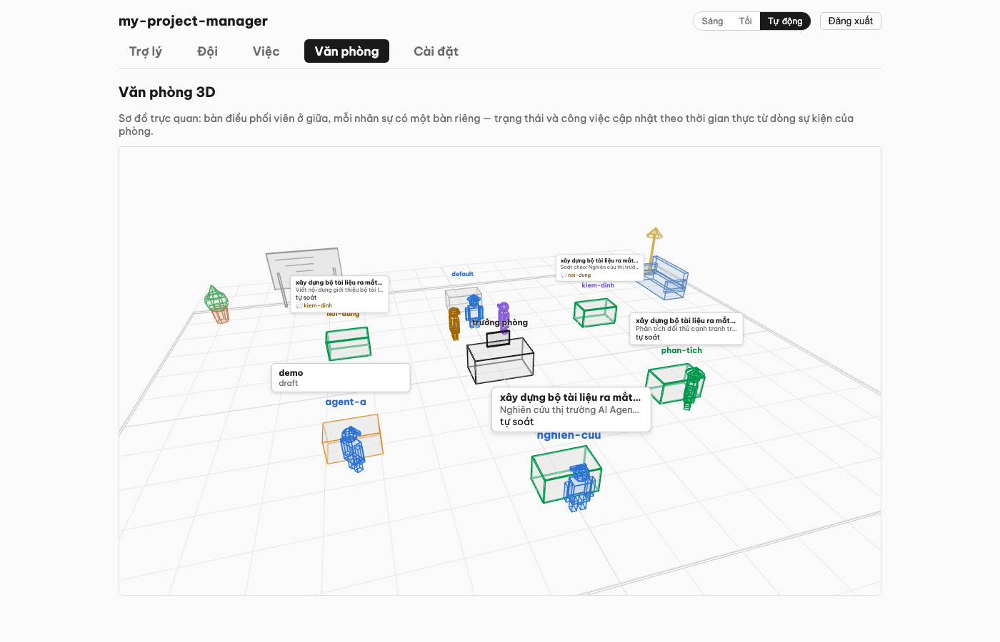

    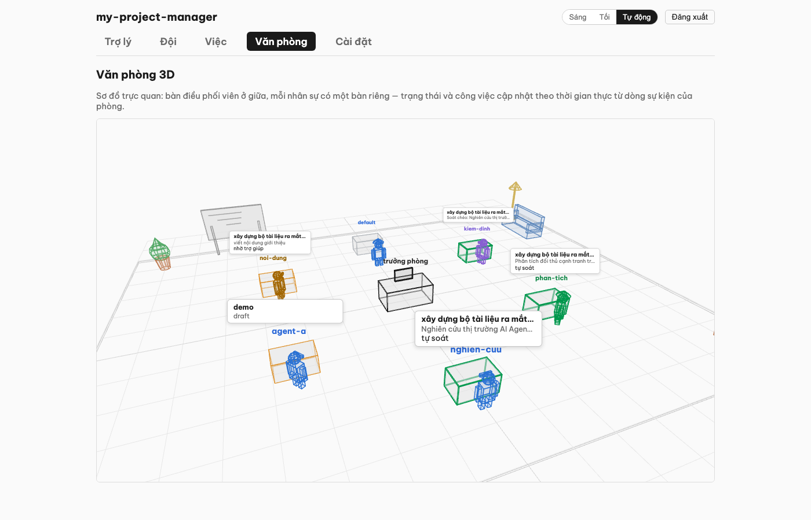

    
- Nếu một agent **chết ngầm** (quá hạn không chạy), hệ thống tự nhắn cảnh báo cho bạn qua Telegram.

## B.6. Đổi giao diện (sáng / tối)

Góc phải trên cùng có nút **Sáng / Tối / Tự động**. "Tự động" theo cài đặt của máy. Lựa chọn được ghi
nhớ cho lần sau.

## B.7. Chế độ nâng cao (khi cần xem sâu)

Vào **Cài đặt → Chế độ hiển thị** → bật **"Chế độ nâng cao"**. Thanh điều hướng hiện thêm các trang kỹ
thuật (tất cả tiếng Việt):

| Trang | Nội dung |
|---|---|
| **Tổng quan** | Bảng toàn bộ agent + trạng thái. |
| **Dòng thời gian** | Lịch sử các lần chạy. |
| **Chi phí** | Biểu đồ chi phí so với ngân sách. |
| **Bộ nhớ** | Điều trợ lý đã ghi nhớ + đề xuất chờ duyệt. |
| **Guardrail** | Nhật ký cửa kiểm soát: việc nào cho chạy / bị chặn / chờ duyệt. |
| **Cấu hình** | Chỉnh hồ sơ agent (danh tính, ngữ cảnh dự án). |
| **Chạy tay** | Chạy một báo cáo ngay, chọn loại + đối tượng (nội bộ / đối ngoại). |
| **Văn phòng** | Dòng thời gian công việc đội + 3D wireframe office (nếu bật v12). |

Tắt lại để về giao diện gọn 4 mục. Chế độ này chỉ đổi *độ chi tiết hiển thị*, không đổi quyền hạn.

## B.8. Chế độ demo (công ty mẫu, sẵn sàng cho khách xem)

Cần cho khách/đồng nghiệp xem sản phẩm mà không lộ dữ liệu thật? Bật **demo mode**:

```bash
scripts/demo-mode.sh on      # bật: công ty demo + đội 6 nhân sự chuẩn + văn phòng đang hoạt động
scripts/demo-mode.sh off     # tắt: trả lại nguyên vẹn dữ liệu thật (đã kiểm chứng byte-identical)
scripts/demo-mode.sh status  # đang ở chế độ nào
```

Khi bật, bạn có ngay: công ty "Công ty Demo — Một Người Vận Hành" với trưởng phòng +
5 nhân sự (nghiên cứu / nội dung / phân tích / kiểm định / thiết kế), và Văn phòng 3D
đang sống giữa chừng một việc thật: nghiên cứu đã bàn giao, phân tích đang làm và đang
tham vấn nghiên cứu (hai avatar đứng cạnh nhau 💬), nội dung đang sửa theo soát chéo,
thiết kế chờ tới lượt. Có thể giao thêm việc thật ngay trong demo (cần LLM key trong
`.env` — demo mode không đụng `.env`).

An toàn: dữ liệu thật (registry, company, hồ sơ nhân sự trùng tên, timeline/việc) được
**di chuyển** vào `.demo-backup/` (không copy-đè) và trả lại nguyên vẹn khi tắt; các
nhân sự demo đặt `dry_run: true` nên không ghi gì ra kênh ngoài. Lưu ý: đang bật demo
thì `registry.yaml` khác bản gốc — **tắt demo trước khi commit code**.

---

## Câu hỏi thường gặp

**Trợ lý có tự đăng linh tinh ra ngoài không?** Không. Mọi việc gửi ra ngoài công ty đều vào hàng đợi
**Việc** chờ bạn duyệt. Việc nguy hiểm thì bị chặn cứng, kể cả bạn muốn duyệt.

**Lỡ trợ lý làm sai thì sao?** Mọi hành động ghi vào một nhật ký không sửa được (audit log), và bạn
duyệt trước những việc có tác động. Việc gây mất-dữ-liệu vĩnh viễn thì hệ thống không cho làm.

**Tốn tiền không?** Có giới hạn ngân sách LLM $50/tháng, tự dừng khi chạm trần, cảnh báo ở mức 80%.

**Agent không chạy, kiểm tra ở đâu?** **Cài đặt → Sức khỏe hệ thống** — bảng ✓/✗ + lệnh khắc phục.

**Muốn cài lại / cập nhật?** Chạy lại `./deploy/install.sh` (Phần A.2) — an toàn, không phá gì nếu
không có thay đổi.

**Nhân sự Nghiên cứu có dùng web search không?** Nếu bật ở Setup Wizard (bước 5), nó sẽ tìm kiếm web khi cần. Không bật = chỉ dùng dữ liệu nội bộ. Web search được che chắn (query không xem được, chỉ tóm tắt kết quả).

**Giao việc cho đội mất bao lâu?** Tùy độ phức tạp, từ vài phút (công việc đơn) đến vài giờ (đa bước). Tiền tố tính chi phí + hỏi bạn confirm trước khi chạy. Nếu quá budget ($2/việc mặc định), hệ thống dừng + báo bạn.

**Soát chéo (peer review) hoạt động như thế nào (v13)?** Sau mỗi bước xong, một đồng nghiệp khác (tự động chọn, thường là kiểm định/QA nếu có) sẽ soát lại. Họ có thể chấp thuận ("đạt") hoặc yêu cầu sửa ("cần sửa"). Nếu cần sửa, tác giả bước sửa lại ≤2 lần. Nếu vẫn không đạt, hệ thống báo CEO.

**Tự kiểm (self-check) là gì (v13)?** Sau khi làm xong bước, trợ lý tự đối chiếu bước với yêu cầu (criteria) của bước đó. Nếu chưa tốt, nó tự sửa (rework) ≤2 lần trước khi báo CEO. Cái này **tự động**, bạn không cần duyệt từng lần tự kiểm.

**Hỏi ý kiến đồng nghiệp tốn tiền không (v13)?** Có, nhưng **ít hơn một bước độc lập**. Hỏi ý kiến là tham khảo (≤2 câu/bước), không phải làm lại bước. Chi phí tính vào tổng của bước đó.

**Chỉnh kế hoạch giữa chừng có an toàn không (v13)?** Hoàn toàn an toàn. Những bước **đã xong** giữ nguyên (không mất dữ liệu). Chỉ những bước chờ chạy mới theo kế hoạch mới. CEO (bạn) xác nhận DIFF trước khi áp dụng.

**Bước kẹt quá 2 lần tự kiểm/soát thì sao (v13)?** Hệ thống dừng + báo CEO xem xét. Bạn có thể chỉnh kế hoạch (bỏ bước, giao lại người, hoặc tăng giới hạn sửa).

---

Xem thêm: [Changelog](project-changelog.md) · [Getting Started (EN, chi tiết)](v2/getting-started.md) ·
[Action Gateway — cơ chế an toàn](v1/action-gateway-explainer.md).
